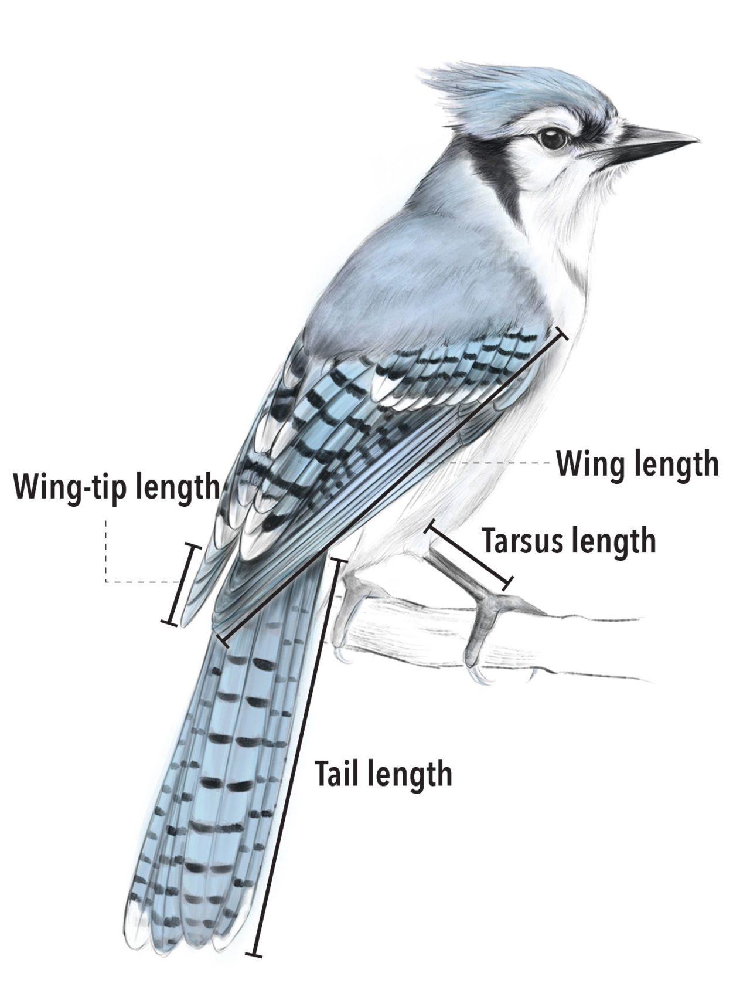
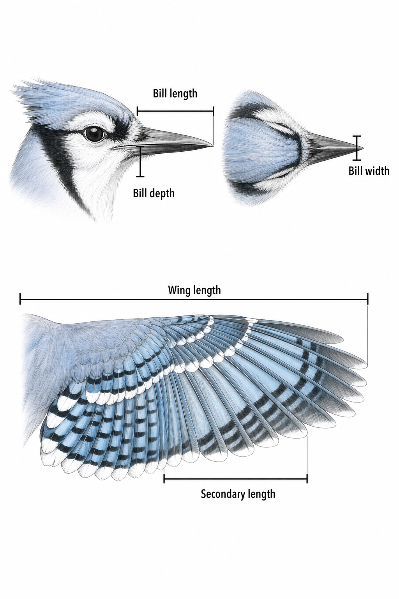

**Allometry** is the study of how one biological trait changes as another
measure of size changes. A familiar example is that a larger animal tends to
have longer limbs, but not necessarily in direct proportion to body size.
Allometry measures how fast one feature changes relative to the other.

A common allometric model is a power law:

$$
Y = aX^b
$$

Here, $X$ is a size measure, $Y$ is the trait being explained, $a$ sets the
overall scale, and $b$ is the **scaling exponent**. Taking logarithms turns the
curve into a straight-line model:

$$
\log(Y) = \log(a) + b\log(X)
$$

When the two measurements have
the same dimensions, $b=1$ means proportional or **isometric** scaling;
$b>1$ means that $Y$ increases more than proportionally; and $b<1$ means that
it increases less than proportionally. Logging allows very small and very
large organisms to share a readable axis.

::: {.callout-tip title="Reading"}
Read Baillie et al. (2022), [Ten simple rules for initial data
analysis](https://doi.org/10.1371/journal.pcbi.1009819), *PLOS Computational
Biology* 18(2), for a short workflow: checking
data structure, metadata, missingness and plausibility before modelling.
:::

All code runs in your browser. The first cell may take a few seconds while
Python loads.

```{pyodide}
#| autorun: true
#| edit: false
import js
import numpy as np
import pandas as pd
import altair as alt
import matplotlib.pyplot as plt
from pyodide.http import open_url

# Data files live beside this page; the Python worker runs from site_libs/.
DATA_URL = js.location.href.split("site_libs/")[0] + "data/"

# show text columns in full instead of truncating them with "..."
pd.set_option("display.max_colwidth", None)

# Keep chart datasets small enough to embed in the page.
alt.data_transformers.enable("default", max_rows=12_000)

plt.rcParams.update({
    "figure.figsize": (9, 5),
    "axes.spines.top": False,
    "axes.spines.right": False,
    "axes.grid": True,
    "grid.alpha": 0.22,
    "font.size": 11,
})
print("Environment ready.")
```

```{pyodide}
#| autorun: true
#| include: false
# Pre-build every name the page uses, so each cell works no matter which
# cells were run before it. The visible cells re-derive all of this.
birds = pd.read_csv(open_url(DATA_URL + "avonet_individuals.csv"), low_memory=False)
measured = birds[birds["data_type"].notna()]

metadata = pd.read_csv(open_url(DATA_URL + "avonet_metadata.csv"))
metadata_types = metadata.assign(
    documented_type=metadata["variable_type"].fillna("not specified")
)

trait_catalogue = (metadata
    .loc[metadata["variable_type"].eq("continuous"),
         ["column", "source_variable", "unit"]]
    .rename(columns={"source_variable": "trait"})
    .reset_index(drop=True))
trait_catalogue["trait"] = (trait_catalogue["trait"]
    .str.replace(".", " ", regex=False)
    .str.replace("_", " ", regex=False))
trait_columns = trait_catalogue["column"].tolist()
trait_names = dict(zip(trait_catalogue["column"], trait_catalogue["trait"]))

def first_example(series):
    observed = series.dropna()
    if observed.empty:
        return "-"
    value = observed.iloc[0]
    return str(round(value, 3) if isinstance(value, float) else value)[:45]

audit = pd.DataFrame({
    "column": birds.columns,
    "dtype": birds.dtypes.astype(str).values,
    "observed_n": birds.notna().sum().values,
    "missing_n": birds.isna().sum().values,
    "missing_pct": (birds.isna().mean().mul(100).round(2)).values,
    "distinct_observed": birds.nunique(dropna=True).values,
    "example": [first_example(birds[c]) for c in birds.columns],
}).merge(metadata_types[["column", "description", "documented_type", "unit"]],
         on="column", how="left")

rows_per_species = (birds.dropna(subset=["species"])
    .groupby("species")
    .size())

species_depth = (measured.groupby("species").size()
                 .rename("individuals").reset_index())

species_wing = (measured.dropna(subset=["species", "wing_length_mm"])
    .groupby("species")["wing_length_mm"]
    .agg(
        n="count",
        mean="mean",
        median="median",
        minimum="min",
        q25=lambda values: values.quantile(0.25),
        q75=lambda values: values.quantile(0.75),
        maximum="max",
        sd="std",
    )
    .reset_index())

scale_pair = birds.dropna(
    subset=["species", "tarsus_length_mm", "beak_length_culmen_mm"]
)
scale_sample = scale_pair.sample(n=6000, random_state=36104)
regression_sample = (scale_pair[["tarsus_length_mm", "beak_length_culmen_mm",
                                 "data_type"]]
                     .sample(n=8000, random_state=36104).copy())
regression_sample["log10_tarsus"] = np.log10(regression_sample["tarsus_length_mm"])
regression_sample["log10_culmen"] = np.log10(regression_sample["beak_length_culmen_mm"])

clean = birds.dropna(subset=["species", "beak_length_culmen_mm", "tarsus_length_mm"])
species_means = (clean
                 .groupby("species")[["beak_length_culmen_mm", "tarsus_length_mm"]]
                 .mean())
r_ind = np.corrcoef(np.log10(clean["tarsus_length_mm"]),
                    np.log10(clean["beak_length_culmen_mm"]))[0, 1]
amniote = pd.read_csv(open_url(DATA_URL + "amniote_species.csv"))
```

```{pyodide}
#| autorun: true
#| include: false
# Altair chart styling for the whole page.
def course_theme():
    return {
        "config": {
            "view": {"stroke": None},
            "background": "transparent",
            "font": "Source Sans Pro, -apple-system, sans-serif",
            "axis": {"gridColor": "#e8e2d6", "domainColor": "#b9b2a4",
                     "tickColor": "#b9b2a4", "labelColor": "#4a463c",
                     "titleColor": "#2b2a26", "labelFontSize": 12,
                     "titleFontSize": 13, "titleFontWeight": 600},
            "legend": {"labelColor": "#4a463c", "titleColor": "#2b2a26",
                       "labelFontSize": 12, "titleFontSize": 12},
            "title": {"anchor": "start", "fontSize": 15, "fontWeight": 600,
                      "color": "#232028", "offset": 12},
            "bar": {"color": "#4269d0"},
            "range": {"category": ["#4269d0", "#e66852", "#30a8b1",
                                   "#c98a00", "#9475cd", "#8a8a8a"]},
        }
    }

try:
    alt.themes.register("course", course_theme)
    alt.themes.enable("course")
except Exception:
    pass
```

## Part I · AVONET

[AVONET](https://doi.org/10.6084/m9.figshare.16586228.v7) is a global bird
trait database assembled by Tobias et al. (2022). Its raw-data worksheet
combines measurements from museum specimens and live birds. A measured row
records the bird's taxonomic identities, sampling provenance, sex and age,
collection geography, ten morphological traits, the measurer, and whether the
AVONET measurement protocol was used.

```{=html}
<figure class="figure">
  <div style="display: flex; flex-direction: row; flex-wrap: nowrap; justify-content: center; align-items: center; gap: 10px; max-width: 620px; margin: 0 auto;">
      
      
  </div>
  <figcaption class="figure-caption text-center">
    The complete group of AVONET measurement examples: bill, wing, wing-tip,
    secondary, tarsus and tail traits. Original Blue Jay illustration by Jillian
    Ditner; companion panels recreated from the source layout for this course.
    Source:
    <a href="https://www.allaboutbirds.org/news/sizing-up-the-worlds-birds-with-avonet/">Living Bird, Cornell Lab of Ornithology</a>.
  </figcaption>
</figure>
```

The dataset is documented in Tobias et al.,
["AVONET: morphological, ecological and geographical data for all birds"](https://onlinelibrary.wiley.com/doi/10.1111/ele.13898),
published in *Ecology Letters*. Keep the paper open while working through this
EDA: it shows how the dataset's authors turned these records into visual
evidence.

::: {.callout-important title="Review the AVONET paper"}
Review **every visualisation in the paper**, treating every panel in a
multi-panel figure as a separate design decision. For every figure or panel, consider:

1. **Visual form:** What type of visualisation is used: scatterplot, map,
   histogram, density display, diagram, coefficient plot, or another form?
   What marks and channels carry the information?
2. **Data visualised:** Which features are shown, what are their data
   types, what does one observation represent, and which rows or taxa are
   included or excluded?
3. **Transformation and aggregation:** Are values raw, logged, standardised,
   binned, averaged, modelled, grouped by species, or otherwise transformed?
4. **Scales and encodings:** Are position and colour scales linear,
   logarithmic, categorical, sequential, or diverging? What is mapped to
   position, colour, size, shape, connection, or facet?
5. **Claim supported:** What comparison, pattern, or model result is the panel
   intended to support? State the claim in one precise sentence.
6. **Strength of support:** Does the chosen visualisation make that claim
   convincing? Identify ambiguity, overplotting, aggregation effects,
   uncertainty, missing context, or a plausible alternative visual form.

:::

### Load and inspect data and metadata

Start by reading both the data and the metadata supplied with it. `.shape`
gives the number of rows and columns, while `info()` reports each column's
storage type and non-missing count.

```{pyodide}
birds = pd.read_csv(
    open_url(DATA_URL + "avonet_individuals.csv"),
    low_memory=False,
)
metadata = pd.read_csv(open_url(DATA_URL + "avonet_metadata.csv"))

print(f"table shape: {birds.shape[0]:,} rows × {birds.shape[1]} columns")
birds.info()
```

Non-null counts differ between columns. Two columns (`locality` and `country`) have
**zero** observed values: entirely empty in this release. 
Every column is stored as one of two data types, text (`object`) or
decimal number (`float64`).

The metadata file has 26 rows (one row for each feature in
`birds`). Its six columns describe different parts of that feature:

- `column`: the column name used in the CSV served on this site;
- `source_variable`: its original heading in the AVONET worksheet;
- `description`: what the recorded values mean;
- `variable_type`: AVONET's semantic classification of the feature;
- `unit`: the measurement unit, where one applies;
- `metadata_source`: the taxonomy, publication or other reference supporting
  the definition.

Inspect the structure and a few complete metadata rows before using it.

```{pyodide}
print(f"metadata shape: {metadata.shape[0]} rows × {metadata.shape[1]} columns")
print(metadata.columns.tolist())
metadata.head(3)
```

Check that the dictionary actually covers the data file. Its `column`
field should contain exactly the same names as `birds.columns`.

```{pyodide}
set(metadata["column"]) == set(birds.columns)
```

Make an inspection function to read the metadata definitions.

```{pyodide}
import textwrap

metadata_by_column = metadata.set_index("column")

def inspect_field(column):
    documentation = metadata_by_column.loc[column]
    definition = str(documentation["description"])
    documented_type = (
        documentation["variable_type"]
        if pd.notna(documentation["variable_type"])
        else "not specified"
    )
    unit = documentation["unit"] if pd.notna(documentation["unit"]) else "-"
    values = birds[column]

    print(column)
    print(textwrap.fill(definition, width=82,
                        initial_indent="    ", subsequent_indent="    "))
    print(f"    documented type: {documented_type}")
    print(f"    unit: {unit}")
    print(f"    storage: {values.dtype}")
    print(f"    observed: {values.notna().sum():,} / {len(values):,}")
    print(f"    distinct observed values: {values.nunique(dropna=True):,}")
    print()

for column in birds.columns:
    inspect_field(column)
```

For this analysis, a "species" means a distinct name in the BirdLife taxonomy
used by this AVONET release. Why keep both `avibase_id` and `species`?

- `avibase_id` is a machine-readable key used to link a taxon to Avibase. The
  full metadata definition says **species or species group**, not necessarily
  one currently accepted species.
- `species` is the human-readable scientific name assigned under the
  particular BirdLife taxonomy used by this release. It is useful for tables,
  labels and grouping, but a name can change when a species moves genus or
  when a taxonomic authority splits or lumps taxa.

The identifier is useful for joining; the species name is useful for grouping
and interpretation. The `species_ebird`, `ebird_species_group` and
`species_birdtree` columns preserve alternative classifications needed for
other analyses. We will use the BirdLife `species` field for the first count.

How many rows and species labels are present?

```{pyodide}
rows_per_species = (birds.dropna(subset=["species"])
    .groupby("species")
    .size())

pd.Series({
    "rows in the file": len(birds),
    "rows with a BirdLife species label": birds["species"].notna().sum(),
    "rows without a BirdLife species label": birds["species"].isna().sum(),
    "unique BirdLife species labels": birds["species"].nunique(),
    "mean rows per labelled species": rows_per_species.mean(),
    "median rows per labelled species": rows_per_species.median(),
    "species labels occurring once": rows_per_species.eq(1).sum(),
    "maximum rows for one species label": rows_per_species.max(),
}).round(2)
```

The file has 90,371 rows and 11,020 distinct BirdLife species labels. Of those
rows, 90,033 have a value in `species` and 338 do not. Dividing the labelled
rows by the number of labels gives a crude mean of 8.17 rows per species, but
the median is five and 734 species labels occur only once. 

The rows are not spread evenly across species, as can be seen in a histogram of the 
number of rows 

```{pyodide}
counts_of_counts = rows_per_species.value_counts().sort_index()

fig, axes = plt.subplots(1, 3, figsize=(10, 3.2))
axes[0].hist(rows_per_species, color="#4269d0")
axes[0].set_title("histogram, default bins")
axes[1].hist(rows_per_species, color="#4269d0")
axes[1].set_yscale("log")
axes[1].set_title("same, log y")
axes[2].bar(counts_of_counts.index, counts_of_counts.values, color="#4269d0")
axes[2].set_xlim(0.5, 30.5)
axes[2].set_title("exact counts, shown to 30")
for ax in axes:
    ax.set_xlabel("rows per species")
axes[0].set_ylabel("number of species")
plt.tight_layout()
plt.show()
```

The histogram is drawn three different ways here.
The default (left) obscures the distribution in a single bar. Logging the y axis (middle)
makes the tail visible (the small number of species with many rows), but
counting each integer value exactly shows the real shape, with
734 single-row species and a spike at 4 and 5 rows (AVONET's protocol
aimed for at least four birds per species). To make this visible, the graph (right) is truncated at 30 rows.

**The text columns.** For these, `describe` reports how many values are
observed, how many are distinct, and the most common value with its
frequency:

```{pyodide}
birds.describe(include="object").T
```
s
The `unique` column sorts the text fields; this may be thousands of distinct values or a small class list
with
counts that fit on screen.

```{pyodide}
birds["sex"].value_counts(dropna=False)
```

45,523 males, 30,221 females, 14,276 birds of unknown sex, and 351
blanks from rows investigated below. Do the same for
`country_wri` - the usable geography field - and `measurer`, which identifies who
measured.

```{pyodide}
#| exercise: ex_text_counts
# Your code here.
```

::: {.hint exercise="ex_text_counts"}
Select one column and call `.value_counts(dropna=False)`, just as in the sex
example. Both fields have many levels, so append `.head(15)` to keep each
result readable. Use `print()` to give each result a heading.
:::

::: {.solution exercise="ex_text_counts"}
```python
print("15 most frequent country_wri values")
print(birds["country_wri"].value_counts(dropna=False).head(15))

print("\n15 most frequent measurers")
print(birds["measurer"].value_counts(dropna=False).head(15))
```
:::

**The number columns.** The default `describe` covers these:

```{pyodide}
birds.describe().T.round(2)
```

Read the feature summary statistics. Three
columns have unusually small ranges: `data_type` is only ever 1 or 2,
and `age` and `protocol` only 0 or 1. These are categorical codes
(encodings stored as a number). Refer to the metatdata.

`info()` showed 90,020 observed values in `data_type`, although the file has
90,371 rows. The metadata identifies `1` as a museum specimen and `2` as a live
individual. It does not explain the missing values. Isolate those rows
and check what fields they do have:

```{pyodide}
untyped = birds.loc[birds["data_type"].isna()].copy()

populated = untyped.columns[untyped.notna().any()].tolist()
populated
```

Of 26 columns, only six contain anything: the five taxonomy and
identifier fields, and `measurer`. Run value counts across all six and
compare their shapes.

```{pyodide}
for column in populated:
    counts = untyped[column].value_counts()
    print(f"{column}: {len(counts)} distinct values; "
          f"most common: {counts.index[0]!r} x {counts.iloc[0]}")
```

The `measurer` field for these rows takes on a single value, `GAPSPECIES`, repeated in all 351 rows.
Confirm none of these rows carries a measurement.

```{pyodide}
measurement_columns = [
    column for column in birds.columns
    if column.endswith("_mm")
] + ["hand_wing_index"]

gap_check = pd.Series({
    "rows with missing data_type": len(untyped),
    "rows labelled GAPSPECIES": untyped["measurer"].eq("GAPSPECIES").sum(),
    "rows with any morphology value": (
        untyped[measurement_columns].notna().any(axis=1).sum()
    ),
    "distinct BirdLife species labels": untyped["species"].nunique(),
}, name="count")

gap_check
```

### Introduction to Altair

[Vega-Altair](https://altair-viz.github.io/) implements a **grammar of
graphics**. A chart is built from a small set of parts that can be combined in
different ways. An Altair specification can be read as a process, from left to right:

> **data → transformation → mark → encoding → scale → guide → composition**

- **Data** is the table supplied to the chart. In tidy data, one row is one
  observation, and one column is one feature.
- A **transformation** filters, groups, counts, averages or bins of those rows.
  This determines what one mark in the resulting chart represents.
- The **mark** is the geometric object used to show that result: a bar, point,
  line, area, rectangle or text label.
- An **encoding** maps a data field to a visual channel such as x-position,
  y-position, colour, size, shape or opacity.
- A **scale** translates values in the data domain into positions, lengths,
  sizes or colours in the visual range.
- A **guide** (an axis or legend) explains that scale to the reader.
- **Composition** combines views through layers, facets or concatenation;
  interaction can then add selections, filtering and linked views.

The first question is: **how many AVONET rows are there of each record type?**
The unit being counted is an AVONET row, and `data_type` are the groups of interest.
The aggregation is a row count. Build a small table:

```{pyodide}
record_counts = (
    birds["data_type"]
    .map({1: "Museum specimen", 2: "Live individual"})
    .fillna("Taxonomy-only GAPSPECIES")
    .value_counts()
    .rename_axis("record_type")
    .reset_index(name="rows")
)

record_counts
```

Now attach that table to an Altair `Chart`, choose rectangular marks, and map
the two fields to position:

```{pyodide}
(alt.Chart(record_counts)
 .mark_bar()
 .encode(
     x="rows:Q",
     y="record_type:N",
 ))
```

Read that code literally:

- `alt.Chart(record_counts)` supplies the data.
- `.mark_bar()` says that each result should be drawn as a rectangle.
- `.encode(...)` maps data fields to visual channels.
- `x="rows:Q"` maps `rows` to horizontal position and declares it
  **quantitative**.
- `y="record_type:N"` maps `record_type` to vertical position and declares it
  **nominal**.

The shorthand is always `"field:type"`. The field is a column in the table;
the letter after the colon tells Altair what the values mean. The main
types are:

- `Q`, quantitative: numeric magnitude; differences or ratios;
- `N`, nominal: unordered categories; only same/different is meaningful;
- `O`, ordinal: categories with a defensible order;
- `T`, temporal: dates or times;
- `G`, geographic: GeoJSON shapes.

An identifier is normally declared `N`, but that does not make it a good
axis or colour field. A species identifier with 11,020 levels could not be effectively encoded in color.

The channel objects `alt.X`, `alt.Y`,
`alt.Color` and `alt.Tooltip` specify what will be included in a
finished chart:

```{pyodide}
record_chart = (
    alt.Chart(record_counts)
    .mark_bar(color="#4269d0")
    .encode(
        x=alt.X(
            "rows:Q",
            title="Rows",
            scale=alt.Scale(zero=True),
        ),
        y=alt.Y(
            "record_type:N",
            title=None,
            sort="-x",
            axis=alt.Axis(labelFontSize=14, labelLimit=280),
        ),
        tooltip=[
            alt.Tooltip("record_type:N", title="Record type"),
            alt.Tooltip("rows:Q", title="Rows", format=","),
        ],
    )
    .properties(
        width=560,
        height=150,
        title="What kind of record is each AVONET row?",
    )
)

record_chart
```

Chart objects:

- **mark** controls the geometric object and its constant appearance;
- **encoding** maps a changing data value to position, colour, size, shape
  or another visual channel;
-**scale** translates a data domain into visual values such as pixels or
  colours;
- an axis or legend is a **guide** that explains that scale;
- `sort="-x"` orders categories by decreasing x-value;
- a **tooltip** reveals values on demand without crowding the static display;


Compare `mark_bar(color="#4269d0")` with
`encode(color="record_type:N")`. The first gives every mark the same colour;
the second creates a data mapping and therefore a colour scale. Colour is redundant in the right-hand chart because vertical position already
separates the three record types. Use the constant colour unless the colour
mapping helps answer the question.

```{pyodide}
comparison_base = (alt.Chart(record_counts)
    .encode(
        x=alt.X("rows:Q", title="Rows"),
        y=alt.Y("record_type:N", title=None, sort="-x"),
        tooltip=["record_type:N", alt.Tooltip("rows:Q", format=",")],
    ))

constant_colour = (comparison_base
    .mark_bar(color="#4269d0")
    .properties(width=260, height=125, title="Constant colour"))

mapped_colour = (comparison_base
    .mark_bar()
    .encode(color=alt.Color("record_type:N", legend=None))
    .properties(width=260, height=125, title="Colour encodes record type"))

constant_colour | mapped_colour
```


The metadata has one row for each of AVONET's 26 features. Suppose we want to
know how many features have each documented type. We can refer to the metadata's `variable_type` column.

We use pandas `groupby` and `size` to count occurances. `groupby("variable_type")` collects rows that share the same variable type and `.size()` counts how many rows are in each group.

```{pyodide}
metadata_type_counts = (
    metadata_types
    .groupby("variable_type", as_index=False)
    .size()
    .rename(columns={"size": "features"})
)

metadata_type_counts
```


The metadata's `variable_type` column has two
blank entries. As we do not want a blank group label, copy it into a
new column with the blanks filled in.

```{pyodide}
metadata_types = metadata.assign(
    documented_type=metadata["variable_type"].fillna("not specified")
)
```


Now the chart is straightforward. Each row of `metadata_type_counts` becomes
one bar. The type determines the bar's vertical position; the number of
features determines its length.

```{pyodide}
(alt.Chart(metadata_type_counts)
 .mark_bar(color="#30a8b1")
 .encode(
     x=alt.X("features:Q", title="Number of features"),
     y=alt.Y("variable_type:N", title=None, sort="-x"),
     tooltip=[
         alt.Tooltip("variable_type:N", title="Documented type"),
         alt.Tooltip("features:Q", title="Features"),
     ],
 )
 .properties(
     width=520,
     height=190,
     title="Variable types in the AVONET metadata",
 ))
```

The aggregation happens in Pandas and the visual encoding happens in Altair.
Later
we will build tables with `mean`, `median`, `min`, `max` and quantiles before
comparing how those different summaries change a chart's claim.

::: {.callout-tip title="Make one change at a time"}
Return to the `record_chart` cell and try these edits separately:

1. Swap the x and y encodings. What changes, and what stays invariant?
2. Remove `sort="-x"`. Which ordering does Altair choose?
3. Replace `.mark_bar(...)` with
   `.mark_point(filled=True, size=100, color="#4269d0")`. Does a zero baseline
   still matter in the same way?
4. Change `rows:Q` to `rows:O`. Inspect the axis. The numbers did not change,
   but their semantic type (and therefore the scale) did.

For each edit, name the component you changed: data, mark, encoding,
aggregation, scale, guide or view.
:::

Use this sequence when designing the charts that follow:

> **feature → data type → question → transformation/aggregation → mark →
> encoding → scale → interpretation**


Extend the structural check to every column (storage type, observed and
missing rows, percentage missing, distinct values), but read the result
as a chart rather than a 26-row table:

```{pyodide}
audit = pd.DataFrame({
    "column": birds.columns,
    "dtype": birds.dtypes.astype(str).values,
    "observed_n": birds.notna().sum().values,
    "missing_n": birds.isna().sum().values,
    "missing_pct": (birds.isna().mean().mul(100).round(2)).values,
    "distinct_observed": birds.nunique(dropna=True).values,
}).merge(metadata_types[["column", "description", "documented_type", "unit"]],
         on="column", how="left")

print(f"audit table built: one row for each of the {len(audit)} columns")
```

```{pyodide}
column_order = (audit.sort_values(["missing_pct", "column"], ascending=[False, True])
                     ["column"].tolist())

(alt.Chart(audit)
 .mark_bar()
 .encode(
     x=alt.X("missing_pct:Q", title="Missing rows (%)",
             scale=alt.Scale(domain=[0, 100])),
     y=alt.Y("column:N", title=None, sort=column_order),
     color=alt.Color("documented_type:N", title="Documented type"),
     tooltip=[
         alt.Tooltip("column:N", title="Column"),
         alt.Tooltip("missing_n:Q", title="Missing", format=","),
         alt.Tooltip("missing_pct:Q", title="Missing %", format=".2f"),
         alt.Tooltip("distinct_observed:Q", title="Distinct", format=","),
     ],
 )
 .properties(width=700, height=570,
             title="Missingness across all 26 AVONET raw-data columns"))
```

Why this visual form? `column` is nominal and has 26 levels, so it works as a
text-labelled y-position but not as 26 colours. `missing_pct` is quantitative,
so bar length on a common x-axis makes values directly comparable. Colour
shows AVONET's documented variable type. The quantitative scale is fixed to the meaningful 0–100% domain
and starts at zero (truncating a bar scale would exaggerate small differences).
Exact values remain in tooltips rather than cluttering every bar.

Two fields, `locality` and `country`, are completely blank in this public
release; `country_wri` is the usable harmonised geography field. The
publication field is mostly blank because most rows are direct specimen or
field measurements rather than measurements transcribed from papers. Wing
length is almost complete, while several flight-shape and beak measurements
are absent in roughly one-third of rows.

### Row-level completeness

Column percentages do not show whether gaps fall in the same birds. Count
the number of observed morphology fields in every row, and check whether
leading data sources measured the same trait set.

```{pyodide}
row_completeness = (birds[trait_columns].notna().sum(axis=1)
                    .value_counts().sort_index()
                    .rename_axis("traits_observed")
                    .reset_index(name="rows"))

(alt.Chart(row_completeness)
 .mark_bar(color="#30a8b1")
 .encode(
     x=alt.X("traits_observed:O", title="Morphology fields observed (out of 10)"),
     y=alt.Y("rows:Q", title="Rows"),
     tooltip=["traits_observed:O", alt.Tooltip("rows:Q", format=",")],
 )
 .properties(width=650, height=260,
             title="How complete is each raw-data row?"))
```

There are 45,669 rows with all ten traits, while 44,351 measured rows have at
least one morphology gap. The 351 taxonomy-only rows correctly appear with
zero traits. A blanket `dropna()` would therefore throw away about half the
table even when an analysis needs only two columns.

```{pyodide}
top_sources = birds["source"].value_counts().head(12).index
source_subset = birds[birds["source"].isin(top_sources)]
source_sizes = source_subset.groupby("source").size()

availability = (source_subset.groupby("source")[trait_columns].count()
                .div(source_sizes, axis=0).mul(100))
availability.index.name = "source"
availability_long = (availability.reset_index()
                     .melt(id_vars="source", var_name="column",
                           value_name="observed_pct"))
availability_long["trait"] = availability_long["column"].map(trait_names)

(alt.Chart(availability_long)
 .mark_rect()
 .encode(
     x=alt.X("source:N", title="Source",
             sort=birds["source"].value_counts().head(12).index.tolist()),
     y=alt.Y("trait:N", title=None,
             sort=trait_catalogue["trait"].tolist()),
     color=alt.Color("observed_pct:Q", title="Observed (%)",
                     scale=alt.Scale(scheme="viridis", domain=[0, 100])),
     tooltip=["source:N", "trait:N",
              alt.Tooltip("observed_pct:Q", title="Observed %", format=".1f")],
 )
 .properties(width=650, height=300,
             title="Trait coverage differs across the 12 largest sources"))
```

The heatmap uses a **sequential quantitative colour scale** with a fixed
0–100% domain: darker colours mean more observed rows. That is different from
the discrete palette used for documented variable types in the missingness
chart. Colour is less precise than position, but it is effective for scanning
a two-dimensional matrix for blocks and exceptions.

Statisticians distinguish data
missing completely at random (MCAR), missing at random given known
variables (MAR), and missing not at random (MNAR, where the gap depends on
the unobserved value itself). Whole missing blocks aligned with sources
are direct evidence against MCAR: absence here is predictable from
provenance. The consequence is that complete-case analysis both
shrinks the sample and **reweights** it toward the sources that
measured everything.


### Identity and taxonomy checks

The four taxonomic name columns represent
different taxonomic authorities. These can be compared in terms of the number of labels and the level of coverage.

```{pyodide}
taxonomy_columns = ["species", "species_ebird", "ebird_species_group",
                    "species_birdtree"]

taxonomy_audit = pd.DataFrame({
    "taxonomy": taxonomy_columns,
    "observed_rows": [birds[c].notna().sum() for c in taxonomy_columns],
    "missing_rows": [birds[c].isna().sum() for c in taxonomy_columns],
    "distinct_labels": [birds[c].nunique() for c in taxonomy_columns],
})

labels_chart = (alt.Chart(taxonomy_audit).mark_bar(color="#4269d0")
    .encode(
        x=alt.X("distinct_labels:Q", title="Distinct labels", scale=alt.Scale(zero=False)),
        y=alt.Y("taxonomy:N", title=None, sort="-x"),
        tooltip=["taxonomy:N", alt.Tooltip("distinct_labels:Q", format=",")],
    )
    .properties(width=320, height=130, title="Vocabulary size"))

gaps_chart = (alt.Chart(taxonomy_audit).mark_bar(color="#e66852")
    .encode(
        x=alt.X("missing_rows:Q", title="Missing rows"),
        y=alt.Y("taxonomy:N", title=None, sort="-x"),
        tooltip=["taxonomy:N", alt.Tooltip("missing_rows:Q", format=",")],
    )
    .properties(width=320, height=130, title="Taxonomic gaps"))

labels_chart | gaps_chart
```


Four numerically encoded fields should be decoded instead of treated as continuous numbers.

For these categorical features, `count` is the natural first aggregate. A
sorted bar chart uses position and length to compare category frequencies.


```{pyodide}
code_specs = {
    "Record type": ("data_type", {1: "Museum specimen", 2: "Live individual"}),
    "Sex": ("sex", {"M": "Male", "F": "Female", "U": "Unknown"}),
    "Age": ("age", {0: "Adult measurement", 1: "Immature measurement"}),
    "Protocol": ("protocol", {1: "AVONET protocol", 0: "Other protocol"}),
}

code_rows = []
for field_label, (column, labels) in code_specs.items():
    decoded = birds[column].map(labels).fillna("Missing / taxonomy-only")
    for level, count in decoded.value_counts().items():
        code_rows.append({"field": field_label, "level": level, "rows": count})

code_counts = pd.DataFrame(code_rows)

(alt.Chart(code_counts)
 .mark_bar(color="#4269d0")
 .encode(
     x=alt.X("rows:Q", title="Rows"),
     y=alt.Y("level:N", title=None, sort="-x"),
     tooltip=["field:N", "level:N", alt.Tooltip("rows:Q", format=",")],
 )
 .properties(width=300, height=115)
 .facet(facet=alt.Facet("field:N", title=None,
                        sort=["Record type", "Sex", "Age", "Protocol"]),
        columns=2)
 .resolve_scale(y="independent"))
```

This is predominantly a museum dataset: 75,843 individuals are specimens
and 14,177 are live birds. Males outnumber females, 14,276 individuals have
unknown sex, 1,269 rows are coded as immature measurements, and 38,666
measured rows were taken under a protocol other than the AVONET protocol.
These imbalances may matter if sex, age, preservation, or protocol changes a
trait.

### Individuals per species

The first content question is about the **unit of analysis**. The 90,020 measured
rows are individual museum specimens or live birds. The claims of this part
are about species, so before looking at a trait we ask: how many individuals
does each species contribute?

```{pyodide}
depth_summary = (species_depth["individuals"]
                 .describe(percentiles=[0.25, 0.5, 0.75, 0.9, 0.95, 0.99])
                 .rename("individuals_per_species")
                 .to_frame())
depth_summary
```

```{pyodide}
depth_frequency = (species_depth["individuals"].value_counts().sort_index()
                   .rename_axis("individuals").reset_index(name="species_count"))
top_species = species_depth.nlargest(15, "individuals")

depth_chart = (alt.Chart(depth_frequency).mark_line(point=True, color="#4269d0")
    .encode(
        x=alt.X("individuals:Q", title="Individuals per species",
                scale=alt.Scale(type="log")),
        y=alt.Y("species_count:Q", title="Number of species",
                scale=alt.Scale(type="log")),
        tooltip=["individuals:Q", alt.Tooltip("species_count:Q", format=",")],
    )
    .properties(width=330, height=300, title="Sampling-depth distribution"))

top_species_chart = (alt.Chart(top_species).mark_bar(color="#c98a00")
    .encode(
        x=alt.X("individuals:Q", title="Individuals"),
        y=alt.Y("species:N", title=None, sort="-x"),
        tooltip=["species:N", alt.Tooltip("individuals:Q", format=",")],
    )
    .properties(width=330, height=300, title="15 most-sampled species"))

depth_chart | top_species_chart
```

::: {.callout-tip title="Compare this with the earlier histogram"}
Look back at the **right-hand panel** of the three-part histogram above. It
also shows sampling depth: the horizontal axis is the number of records or
individuals per species, and the vertical axis is the number of species.

Before reading on, compare the two displays:

- What does one bar represent in the earlier panel, and what does one point
  represent in the sampling-depth chart?
- Are `rows_per_species` and `species_depth` counting exactly the same rows?
- How do the earlier linear axes and x-axis limit of 30 differ from the two
  logarithmic axes used here?
- What becomes visible in each version, and what becomes harder to judge?
- Does connecting the points with a line suggest anything that the discrete
  integer counts do not actually support?
:::

The median measured species has five individuals, 383 species have only one,
and the most-sampled species has 784. Treating all 90,020 individuals as
independent would let a few heavily sampled species dominate, while treating every
species mean as equally precise would ignore the opposite problem.

### Provenance and geographic coverage

Large global datasets are often collections of collections. The leading
source and country codes reveal whether the table is broadly balanced or
dominated by a few contributors.

```{pyodide}
def top_levels_chart(column, title, n=15, colour="#4269d0"):
    counts = birds[column].dropna().astype(str).value_counts().head(n)
    table = pd.DataFrame({"level": counts.index, "rows": counts.values})
    return (alt.Chart(table)
        .mark_bar(color=colour)
        .encode(
            x=alt.X("rows:Q", title="Rows"),
            y=alt.Y("level:N", title=None, sort="-x"),
            tooltip=[alt.Tooltip("level:N", title=column),
                     alt.Tooltip("rows:Q", format=",")],
        )
        .properties(width=300, height=320, title=title))

source_chart = top_levels_chart("source", "Top 15 sources", colour="#4269d0")
country_chart = top_levels_chart("country_wri", "Top 15 collection countries",
                                 colour="#30a8b1")
source_chart | country_chart
```

Each view performs two transformations before drawing a mark: `count` rows by
category, then keep the 15 largest counts. That top-$N$ filter makes labels
readable but hides the long tail, so the title must disclose it. We use two
separate panels with independent category axes.

The NHMUK source alone contributes 46,060 rows, and the largest country
counts come from tropical, species-rich regions.
We can infer that relationhips may exist between source, protocol, geography, and morphology.

### Morphological features

The table contains ten morphology fields: four beak dimensions, tarsus
length, three wing-feather lengths, hand-wing index, and tail length. The
summary below includes the 1st and 99th percentiles alongside minima and maxim, because means and standard deviations alone hide outliers.

```{pyodide}
trait_catalogue = (metadata
    .loc[metadata["variable_type"].eq("continuous"),
         ["column", "source_variable", "unit"]]
    .rename(columns={"source_variable": "trait"})
    .reset_index(drop=True))
trait_catalogue["trait"] = (trait_catalogue["trait"]
    .str.replace(".", " ", regex=False)
    .str.replace("_", " ", regex=False))

trait_columns = trait_catalogue["column"].tolist()
trait_names = dict(zip(trait_catalogue["column"], trait_catalogue["trait"]))

summary_rows = []
for column in trait_columns:
    values = birds[column].dropna()
    summary_rows.append({
        "trait": trait_names[column],
        "observed_n": len(values),
        "missing_pct": birds[column].isna().mean() * 100,
        "min": values.min(),
        "p01": values.quantile(0.01),
        "median": values.median(),
        "mean": values.mean(),
        "p99": values.quantile(0.99),
        "max": values.max(),
        "nonpositive_n": (values <= 0).sum(),
        "exactly_0.1_n": np.isclose(values, 0.1).sum(),
    })

trait_summary = pd.DataFrame(summary_rows)
trait_summary.round(2)
```

All observed trait values are positive, so logarithms are mathematically
defined.

```{pyodide}
hist_rows = []
for column in trait_columns:
    logged = np.log10(birds[column].dropna().to_numpy())
    counts, edges = np.histogram(logged, bins=32)
    for count, left, right in zip(counts, edges[:-1], edges[1:]):
        hist_rows.append({
            "trait": trait_names[column],
            "bin_start": left,
            "bin_end": right,
            "rows": int(count),
        })

hist_data = pd.DataFrame(hist_rows)

(alt.Chart(hist_data)
 .mark_bar(color="#4269d0")
 .encode(
     x=alt.X("bin_start:Q", title="log10(value)", bin="binned"),
     x2="bin_end:Q",
     y=alt.Y("rows:Q", title="Rows"),
     tooltip=[
         "trait:N",
         alt.Tooltip("bin_start:Q", title="From log10", format=".2f"),
         alt.Tooltip("bin_end:Q", title="To log10", format=".2f"),
         alt.Tooltip("rows:Q", format=","),
     ],
 )
 .properties(width=300, height=130)
 .facet(facet=alt.Facet("trait:N", title=None,
                        sort=trait_catalogue["trait"].tolist()),
        columns=2)
 .resolve_scale(x="independent", y="independent"))
```

A **histogram** is already an aggregate chart: continuous values are transformed
into intervals with `bin`, then rows are aggregated with `count`. Changing the
number or width of bins can reveal or conceal modes and outliers. A box plot
would instead aggregate to quartiles and whiskers. Here, identical histogram marks
make shapes comparable across traits, while independent facet scales let each
trait use its own range. That choice helps see shape, but prevents direct
comparison of absolute magnitudes across panels.

A **violin plot** estimates the distribution continuously rather than dividing it
into histogram bins. At any vertical position, the width of the violin shows
the estimated density of observations near that value. Wide regions contain
concentrated values; narrow regions contain relatively few.

To keep the browser chart responsive, take the same reproducible sample of at
most 1,000 observed values from each trait. Sampling is only for drawing the
violins; the summary table and histograms above still use every observed row.

```{pyodide}
violin_data = (birds[trait_columns]
    .rename(columns=trait_names)
    .melt(var_name="trait", value_name="value")
    .dropna())
violin_data["log10_value"] = np.log10(violin_data["value"])

violin_sample = pd.concat(
    [group.sample(n=min(len(group), 1_000), random_state=36104)
     for _, group in violin_data.groupby("trait")],
    ignore_index=True,
)

(alt.Chart(violin_sample)
 .transform_density(
     "log10_value",
     as_=["log10_value", "density"],
     groupby=["trait"],
 )
 .mark_area(orient="horizontal", color="#30a8b1", opacity=0.82)
 .encode(
     x=alt.X(
         "density:Q",
         stack="center",
         impute=None,
         title=None,
         axis=alt.Axis(labels=False, ticks=False, grid=False),
     ),
     y=alt.Y("log10_value:Q", title="log10(value)"),
 )
 .properties(width=120, height=180)
 .facet(
     facet=alt.Facet(
         "trait:N",
         title=None,
         sort=trait_catalogue["trait"].tolist(),
         header=alt.Header(labelAngle=0, labelLimit=120),
     ),
     columns=5,
 )
 .resolve_scale(x="independent", y="independent"))
```

Compare these violins with the histograms. The violins avoid a visible bin
boundary and make modes easier to scan, but their shape depends on the density
bandwidth. Each facet is independently scaled and normalised, so widths cannot
be compared as sample sizes and vertical positions cannot be compared as
absolute magnitudes across traits. Use the histogram or summary table when
you need counts, ranges, or exact values.

### Linear and logarithmic scales

A scale maps a **data domain** to a **visual range**. An x-scale maps numbers
to horizontal pixel positions; a colour scale maps values or categories to
colours. The scale defines what equal
visual distances mean.

The next two charts use exactly the same values and point marks. On the linear
scale, equal distances represent equal *differences*. On the logarithmic
scale, equal distances represent equal *ratios*.

```{pyodide}
scale_demo = pd.DataFrame({
    "value": [1, 2, 5, 10, 20, 50, 100, 200, 500, 1000],
    "row": ["same ten values"] * 10,
})

scale_base = alt.Chart(scale_demo).mark_circle(size=90, color="#4269d0").encode(
    y=alt.Y("row:N", title=None, axis=alt.Axis(labels=False, ticks=False)),
    tooltip=["value:Q"],
)

linear_scale = scale_base.encode(
    x=alt.X("value:Q", title="Value (linear scale)",
            scale=alt.Scale(type="linear", domain=[1, 1000]))
).properties(width=330, height=70, title="Equal differences occupy equal distance")

log_scale = scale_base.encode(
    x=alt.X("value:Q", title="Value (logarithmic scale)",
            scale=alt.Scale(type="log", domain=[1, 1000]))
).properties(width=330, height=70, title="Equal ratios occupy equal distance")

linear_scale | log_scale
```

A log scale opens  is appropriate
for a power law relationship. A log scale is only defined for positive values.

```{pyodide}
scale_pair = birds.dropna(
    subset=["species", "tarsus_length_mm", "beak_length_culmen_mm"]
)
scale_sample = scale_pair.sample(n=6000, random_state=36104)

bird_points = alt.Chart(scale_sample).mark_circle(
    size=12, opacity=0.12, color="#4269d0"
).encode(
    tooltip=["species:N",
             alt.Tooltip("tarsus_length_mm:Q", format=".1f"),
             alt.Tooltip("beak_length_culmen_mm:Q", format=".1f")],
)

linear_birds = bird_points.encode(
    x=alt.X("tarsus_length_mm:Q", title="Tarsus length (mm)",
            scale=alt.Scale(type="linear", zero=False)),
    y=alt.Y("beak_length_culmen_mm:Q", title="Culmen length (mm)",
            scale=alt.Scale(type="linear", zero=False)),
).properties(width=330, height=300, title="Linear position scales")

log_birds = bird_points.encode(
    x=alt.X("tarsus_length_mm:Q", title="Tarsus length (mm, log scale)",
            scale=alt.Scale(type="log")),
    y=alt.Y("beak_length_culmen_mm:Q", title="Culmen length (mm, log scale)",
            scale=alt.Scale(type="log")),
).properties(width=330, height=300, title="Logarithmic position scales")

linear_birds | log_birds
```

Bars generally need a zero baseline because length
encodes magnitude. Scatterplots do not always need zero because position, not
length, carries the comparison.

### Correlations among the ten traits

A correlation matrix is a compact scan of all pairwise linear relationships
among the logged traits. It is descriptive, not a fitted allometric model:
each cell uses the rows available for that pair, ignores taxonomy and shared
evolutionary history, and does not distinguish within-species from
between-species variation.

```{pyodide}
logged_traits = np.log10(birds[trait_columns])
corr = logged_traits.corr(min_periods=1000)
corr.index.name = "row_trait"

corr_long = (corr.reset_index()
             .melt(id_vars="row_trait", var_name="column_trait", value_name="r"))
corr_long["row_label"] = corr_long["row_trait"].map(trait_names)
corr_long["column_label"] = corr_long["column_trait"].map(trait_names)

trait_order = trait_catalogue["trait"].tolist()
base = alt.Chart(corr_long).encode(
    x=alt.X("column_label:N", title=None, sort=trait_order,
            axis=alt.Axis(labelAngle=-45)),
    y=alt.Y("row_label:N", title=None, sort=trait_order),
)

heatmap = base.mark_rect().encode(
    color=alt.Color("r:Q", title="Pearson r",
                    scale=alt.Scale(scheme="redblue", domain=[-1, 1])),
    tooltip=["row_label:N", "column_label:N", alt.Tooltip("r:Q", format=".3f")],
)

labels = base.mark_text(fontSize=10).encode(
    text=alt.Text("r:Q", format=".2f"),
    color=alt.condition("datum.r > 0.55 || datum.r < -0.55",
                        alt.value("white"), alt.value("#222")),
)

(heatmap + labels).properties(
    width=560, height=520,
    title="Pairwise correlations among all ten log-transformed traits"
)
```

The diverging colour scale is centred at zero because positive and negative
correlations are qualitatively different directions. Its symmetric $-1$ to
$1$ domain prevents the strongest observed value from redefining the meaning
of the colours.

### Regression on raw and logged scales

A regression line can summarise a bivariate trend. A straight-line fit in raw millimetres relates
additive change. A straight-line fit after logging both features asks about
proportional change and estimates an allometric exponent.

The charts below use the same deterministic 8,000-row display sample. Altair's
`transform_regression()` performs the aggregation from thousands of points to
the fitted line. The accompanying table makes the transformation and fit
statistics explicit.

```{pyodide}
regression_sample = (scale_pair[["tarsus_length_mm", "beak_length_culmen_mm",
                                 "data_type"]]
                     .sample(n=8000, random_state=36104).copy())
regression_sample["log10_tarsus"] = np.log10(regression_sample["tarsus_length_mm"])
regression_sample["log10_culmen"] = np.log10(regression_sample["beak_length_culmen_mm"])

def regression_summary(x, y, model):
    slope, intercept = np.polyfit(x, y, 1)
    fitted = intercept + slope * x
    r_squared = 1 - ((y - fitted) ** 2).sum() / ((y - y.mean()) ** 2).sum()
    return {"model": model, "intercept": intercept,
            "slope": slope, "r_squared": r_squared}

regression_stats = pd.DataFrame([
    regression_summary(
        regression_sample["tarsus_length_mm"],
        regression_sample["beak_length_culmen_mm"],
        "raw millimetres: culmen ~ tarsus",
    ),
    regression_summary(
        regression_sample["log10_tarsus"],
        regression_sample["log10_culmen"],
        "log10–log10: culmen ~ tarsus",
    ),
])
regression_stats.round(3)
```

```{pyodide}
raw_base = alt.Chart(regression_sample).encode(
    x=alt.X("tarsus_length_mm:Q", title="Tarsus length (mm)",
            scale=alt.Scale(zero=False)),
    y=alt.Y("beak_length_culmen_mm:Q", title="Culmen length (mm)",
            scale=alt.Scale(zero=False)),
)
raw_regression = (
    raw_base.mark_circle(size=11, opacity=0.10, color="#4269d0")
    + raw_base.transform_regression(
        "tarsus_length_mm", "beak_length_culmen_mm"
      ).mark_line(size=3, color="#e66852")
).properties(width=330, height=300, title="OLS in raw measurement space")

log_base = alt.Chart(regression_sample).encode(
    x=alt.X("log10_tarsus:Q", title="log10 tarsus length"),
    y=alt.Y("log10_culmen:Q", title="log10 culmen length"),
)
log_regression = (
    log_base.mark_circle(size=11, opacity=0.10, color="#4269d0")
    + log_base.transform_regression(
        "log10_tarsus", "log10_culmen"
      ).mark_line(size=3, color="#e66852")
).properties(width=330, height=300, title="OLS in log10–log10 space")

raw_regression | log_regression
```

The red line of best fit is not proof of causality.

### Subgroup check: museum specimens versus live birds

Fit the
same log-log regression separately for museum specimens and live birds:

```{pyodide}
regression_sample["record_type"] = regression_sample["data_type"].map(
    {1: "Museum specimen", 2: "Live individual"})

subgroup_rows = []
for record_type, subset in regression_sample.groupby("record_type"):
    slope, intercept = np.polyfit(subset["log10_tarsus"],
                                  subset["log10_culmen"], 1)
    subgroup_rows.append({
        "record_type": record_type,
        "n": len(subset),
        "slope": slope,
        "r": np.corrcoef(subset["log10_tarsus"],
                         subset["log10_culmen"])[0, 1],
    })
pd.DataFrame(subgroup_rows).round(3)
```

```{pyodide}
subgroup_base = alt.Chart(regression_sample).encode(
    x=alt.X("log10_tarsus:Q", title="log10 tarsus length"),
    y=alt.Y("log10_culmen:Q", title="log10 culmen length"),
    color=alt.Color("record_type:N", title="Record type",
                    scale=alt.Scale(range=["#e66852", "#4269d0"])),
)

(subgroup_base.mark_circle(size=11, opacity=0.15)
 + subgroup_base.transform_regression(
       "log10_tarsus", "log10_culmen", groupby=["record_type"]
   ).mark_line(size=3)
).properties(width=560, height=380,
             title="Same fit, split by record type")
```

In the full data the museum-specimen slope is 0.62 with r = 0.63, close to
the pooled fit, while the live-bird slope is almost exactly **zero**. Live records cover
only 702 species, with
tarsus lengths that span a much narrower range (log10 spread 0.16, versus
0.25 for specimens). Within this narrow range the
between-species scaling signal is weak.

### Subgroup check: age

The metadata warned that `age = 1` marks birds measured while immature,
and immature birds can have not-fully-grown flight feathers.
Comparing all adult wings against all immature wings would
mostly compare different species, but the fair test is within species.

For every species with at least five adult and three immature wing
measurements, take the ratio of the two means:

```{pyodide}
by_age = (measured.dropna(subset=["species", "wing_length_mm", "age"])
    .groupby(["species", "age"])["wing_length_mm"]
    .agg(["count", "mean"])
    .unstack("age"))
by_age.columns = ["n_adult", "n_immature", "mean_adult", "mean_immature"]

enough = by_age[(by_age["n_adult"] >= 5) & (by_age["n_immature"] >= 3)].copy()
enough["ratio"] = enough["mean_immature"] / enough["mean_adult"]

fig, ax = plt.subplots(figsize=(8, 3.6))
ax.hist(enough["ratio"], bins=24, color="#4269d0")
ax.axvline(1.0, color="#e66852", lw=1.5)
ax.set_xlabel("immature mean wing / adult mean wing, within species")
ax.set_ylabel("species")
ax.set_title(f"{len(enough)} species with enough of both; red line = no difference")
plt.show()
```

```{pyodide}
assert len(enough) == 108
assert (enough["ratio"] < 1).sum() == 77
print(f"✓ median ratio {enough['ratio'].median():.3f}: immature wings run about")
print("  1.3% short, in 77 of 108 species, just as the metadata warned")
```

Analysis of
wing length can now decide, explicitly, whether to exclude the 1,269
immature rows or accept a percent of shrinkage.

### Choosing an aggregation function

An aggregate turns many rows into one value or mark.

| Aggregate | Question answered | Useful visual role | Main caution |
|---|---|---|---|
| `count` | How many records? | bar length, point size, annotation | sampling effort is not biological magnitude |
| `mean` | What is the arithmetic centre? | point, line, model input | sensitive to skew and outliers |
| `median` | What is the middle observed value? | point, line inside a box plot | ignores distance from the middle |
| `min`, `max` | What is the observed range? | endpoints of a rule | extremely sample-size and outlier sensitive |
| 25th/75th quantiles | Where is the middle half? | box or thick interval | hides tails |
| standard deviation | How dispersed are values around the mean? | error bar or uncertainty channel | assumes the mean is a useful centre |
| `sum` | What is the total amount? | bar/area for additive quantities | meaningless for anatomical lengths here |

The next transformation groups wing measurements by species and calculates
all the defensible summaries at once. The chart then layers the full range,
interquartile range, median, and mean for the 15 most-sampled species.

```{pyodide}
species_wing = (measured.dropna(subset=["species", "wing_length_mm"])
    .groupby("species")["wing_length_mm"]
    .agg(
        n="count",
        mean="mean",
        median="median",
        minimum="min",
        q25=lambda values: values.quantile(0.25),
        q75=lambda values: values.quantile(0.75),
        maximum="max",
        sd="std",
    )
    .reset_index())

species_wing.nlargest(15, "n").round(2)
```

```{pyodide}
wing_top = species_wing.nlargest(15, "n")
wing_order = wing_top.sort_values("median")["species"].tolist()

wing_base = alt.Chart(wing_top).encode(
    y=alt.Y("species:N", title=None, sort=wing_order),
    tooltip=[
        "species:N", alt.Tooltip("n:Q", format=","),
        alt.Tooltip("minimum:Q", format=".1f"),
        alt.Tooltip("q25:Q", format=".1f"),
        alt.Tooltip("median:Q", format=".1f"),
        alt.Tooltip("mean:Q", format=".1f"),
        alt.Tooltip("q75:Q", format=".1f"),
        alt.Tooltip("maximum:Q", format=".1f"),
        alt.Tooltip("sd:Q", format=".1f"),
    ],
)

full_range = wing_base.mark_rule(color="#b9b2a4", strokeWidth=2).encode(
    x=alt.X("minimum:Q", title="Wing length (mm)", scale=alt.Scale(zero=False)),
    x2="maximum:Q",
)
middle_half = wing_base.mark_rule(color="#4269d0", strokeWidth=8).encode(
    x="q25:Q", x2="q75:Q",
)
median_mark = wing_base.mark_tick(color="#111", thickness=2, size=16).encode(
    x="median:Q",
)
mean_mark = wing_base.mark_circle(color="#e66852", size=55).encode(
    x="mean:Q",
)

(full_range + middle_half + median_mark + mean_mark).properties(
    width=650, height=360,
    title="Species summaries: range, IQR, median (tick), and mean (red point)"
)
```

Mean and median can be compared across every measured species. Point area
encodes sample size. The diagonal is the identity line, $y=x$; it is drawn by
the code, not fitted to the data.

```{pyodide}
identity_limits = pd.DataFrame({
    "x": [species_wing["mean"].min(), species_wing["mean"].max()],
    "y": [species_wing["mean"].min(), species_wing["mean"].max()],
})

mean_median_data = species_wing[["species", "n", "mean", "median"]]

mean_median_points = (alt.Chart(mean_median_data)
    .mark_circle(opacity=0.25, color="#4269d0")
    .encode(
        x=alt.X("mean:Q", title="Species mean wing length (mm)",
                scale=alt.Scale(type="log")),
        y=alt.Y("median:Q", title="Species median wing length (mm)",
                scale=alt.Scale(type="log")),
        size=alt.Size("n:Q", title="Individuals", scale=alt.Scale(type="sqrt")),
        tooltip=["species:N", "n:Q",
                 alt.Tooltip("mean:Q", format=".1f"),
                 alt.Tooltip("median:Q", format=".1f")],
    ))

identity_line = (alt.Chart(identity_limits).mark_line(
    color="#e66852", strokeDash=[6, 4]
).encode(x="x:Q", y="y:Q"))

(mean_median_points + identity_line).properties(
    width=560, height=430,
    title="Aggregation choice: species mean versus species median"
)
```

Position along the diagonal is mainly the difference in wing length between
species. Distance from the diagonal is the difference between a species' mean
and median. The first is much larger, so almost all points lie near $y=x$.

One mark is separated from the rest. It contains five overlapping species:

```{pyodide}
species_wing.nsmallest(8, "mean")[["species", "n", "mean", "median"]]
```

All five are kiwis. Check the underlying records:

```{pyodide}
kiwi_wing = birds.loc[
    np.isclose(birds["wing_length_mm"], 0.1),
    ["species", "wing_length_mm"],
]

(kiwi_wing.groupby("species")["wing_length_mm"]
 .agg(rows="count", distinct_values="nunique", minimum="min", maximum="max"))
```

[Sayol et al. (2024)](https://doi.org/10.1111/geb.13927) document that AVONET
uses the arbitrary value 0.1 for kiwi wing and tail measurements. It is not a
measured wing length. Recode only these documented kiwi pseudo-values as
missing; retain their other measurements.

```{pyodide}
birds_wing_clean = birds.copy()
kiwi_rows = birds_wing_clean["species"].str.startswith("Apteryx", na=False)
kiwi_pseudovalue_fields = [
    "wing_length_mm", "kipps_distance_mm", "secondary1_mm",
    "tail_length_mm", "hand_wing_index",
]

replaced = 0
for column in kiwi_pseudovalue_fields:
    pseudo = kiwi_rows & np.isclose(birds_wing_clean[column], 0.1)
    replaced += int(pseudo.sum())
    birds_wing_clean.loc[pseudo, column] = np.nan

species_wing_clean = (birds_wing_clean
    .dropna(subset=["species", "wing_length_mm"])
    .groupby("species")["wing_length_mm"]
    .agg(n="count", mean="mean", median="median")
    .reset_index())

print(f"Replaced {replaced} kiwi pseudo-values with missing values.")
print(f"Wing-length species: {len(species_wing):,} → {len(species_wing_clean):,}")
```

The raw summary, histogram and correlation matrix above include these values.
Use the cleaned wing data for subsequent wing analysis.

To compare the two aggregations directly, calculate their percentage
difference within each species:

```{pyodide}
aggregation_difference = species_wing_clean.assign(
    difference_pct=lambda table: 100 * (table["mean"] - table["median"])
                                     / table["median"]
)

(aggregation_difference
 .loc[aggregation_difference["difference_pct"].abs().nlargest(10).index,
      ["species", "n", "mean", "median", "difference_pct"]]
 .round(2))
```


::: {.callout-note title="EDA Sources"}
- Tukey (1977), *Exploratory Data Analysis*: the founding text.
- Baillie et al. (2022), [Ten simple rules for initial data analysis](https://doi.org/10.1371/journal.pcbi.1009819), *PLOS Computational Biology*: the assigned reading for this page.
- Huebner et al. (2018), *A contemporary conceptual framework for initial data analysis*, Observational Studies 4:171–192: the full IDA framework.
- Peng, [*Exploratory Data Analysis with R*](https://bookdown.org/rdpeng/exdata/): the EDA checklist ("check your n's"; "validate with an external source").
- Wickham, Cetinkaya-Rundel and Grolemund, [*R for Data Science*, EDA chapter](https://r4ds.hadley.nz/eda): variation and covariation as the two standing questions.
- van der Loo and de Jonge (2018), *Statistical Data Cleaning with Applications in R*: validation rules as code.
- Little and Rubin, *Statistical Analysis with Missing Data*: the MCAR / MAR / MNAR taxonomy.
- Broman and Woo (2018), [Data organization in spreadsheets](https://doi.org/10.1080/00031305.2017.1375989), *The American Statistician*: data dictionaries and raw-file hygiene.
:::

### Cleaning

We want to plot beak length against tarsus length, which means every row we
use needs **both** measurements (and a species name).

```{pyodide}
birds.isna().sum()
```

Keep only the rows
that can support the comparison we actually want to make:

```{pyodide}
clean = birds.dropna(subset=["species", "beak_length_culmen_mm", "tarsus_length_mm"])
print(f"{len(birds):,} rows → {len(clean):,} rows "
      f"({len(birds) - len(clean):,} dropped, {(len(birds)-len(clean))/len(birds):.0%})")
```

```{pyodide}
pd.Series({
    "rows retained": len(clean),
    "species represented": clean["species"].nunique(),
    "minimum culmen length (mm)": clean["beak_length_culmen_mm"].min(),
    "minimum tarsus length (mm)": clean["tarsus_length_mm"].min(),
})
```

We just discarded **nearly a quarter of the dataset**.  Any figure built from this table
should now say 69,509 individual birds, not 90,371.

You should be
able to draw the path from raw file to analysed rows, with the rule that
caused every drop.

```{pyodide}
row_flow = pd.DataFrame([
    ("1. raw worksheet", len(birds), "as downloaded"),
    ("2. individual birds", int(birds["data_type"].notna().sum()),
     "drop 351 taxonomy-only GAPSPECIES rows"),
    ("3. beak-tarsus complete", len(clean),
     "require species, culmen and tarsus"),
], columns=["stage", "rows", "rule"])

(alt.Chart(row_flow)
 .mark_bar(color="#4269d0")
 .encode(
     x=alt.X("rows:Q", title="Rows"),
     y=alt.Y("stage:N", title=None, sort=None),
     tooltip=["stage:N", alt.Tooltip("rows:Q", format=","), "rule:N"],
 )
 .properties(width=600, height=150,
             title="Row flow from raw file to analysis table"))
```

### The individual level

Each point is one individual museum specimen or live bird retained after
requiring both traits. Both axes are logged (allometry is about ratios).

```{pyodide}
fig, ax = plt.subplots(figsize=(8, 6))
ax.scatter(np.log10(clean["tarsus_length_mm"]),
           np.log10(clean["beak_length_culmen_mm"]),
           s=2, alpha=0.1, color="#4269d0")
ax.set_xlabel("log10 tarsus length (mm)")
ax.set_ylabel("log10 beak length, culmen (mm)")
ax.set_title(f"Each point is one individual bird (n = {len(clean):,})")
plt.show()
```

```{pyodide}
r_ind = np.corrcoef(np.log10(clean["tarsus_length_mm"]),
                    np.log10(clean["beak_length_culmen_mm"]))[0, 1]
print(f"correlation of the logged traits, individual level: r = {r_ind:.3f}")
```

### Aggregation to species

`groupby("species").mean()`
collapses the retained individuals for a species into one species mean:

```{pyodide}
species_means = (clean
                 .groupby("species")[["beak_length_culmen_mm", "tarsus_length_mm"]]
                 .mean())
print(species_means.shape)
species_means.head()
```

```{pyodide}
fig, axes = plt.subplots(1, 2, figsize=(11, 5), sharex=True, sharey=True)
axes[0].scatter(np.log10(clean["tarsus_length_mm"]),
                np.log10(clean["beak_length_culmen_mm"]),
                s=2, alpha=0.1, color="#4269d0")
axes[0].set_title(f"Individuals (n = {len(clean):,})")
axes[1].scatter(np.log10(species_means["tarsus_length_mm"]),
                np.log10(species_means["beak_length_culmen_mm"]),
                s=4, alpha=0.25, color="#e66852")
axes[1].set_title(f"Species means (n = {len(species_means):,})")
for ax in axes:
    ax.set_xlabel("log10 tarsus length (mm)")
axes[0].set_ylabel("log10 beak length, culmen (mm)")

r_sp = np.corrcoef(np.log10(species_means["tarsus_length_mm"]),
                   np.log10(species_means["beak_length_culmen_mm"]))[0, 1]
fig.suptitle(f"Same relationship, two levels: r = {r_ind:.3f} (individuals) vs r = {r_sp:.3f} (species)")
plt.tight_layout()
plt.show()
```

Averaging removed 59,000 points but the cloud barely tightened
(r ≈ 0.61 → 0.62). Within-species measurement scatter is small compared to
the real, ecological differences in beak shape *between* species:
hummingbirds, finches and curlews genuinely sit in different places.


### Your turn: a different trait pair {#sec-ex-wing}

Repeat the whole pipeline (**cleaning included**) for **wing length vs
tarsus length**. Start from `birds`, recode the documented kiwi `0.1` wing
values as missing, and then require both measurements. Print n after cleaning
and show the species-level n in the plot title.

```{pyodide}
#| setup: true
#| exercise: ex_wing
import js
import numpy as np
import pandas as pd
import matplotlib.pyplot as plt
from pyodide.http import open_url

DATA_URL = js.location.href.split("site_libs/")[0] + "data/"
birds = pd.read_csv(open_url(DATA_URL + "avonet_individuals.csv"))
```

```{pyodide}
#| exercise: ex_wing
# `birds` is loaded: 90,371 rows, columns species, beak_length_culmen_mm,
# tarsus_length_mm, wing_length_mm.
# 1. Recode the documented kiwi 0.1 wing pseudo-values as missing.
# 2. Drop rows that cannot support a wing-vs-tarsus comparison.
# 3. Aggregate to species means.
# 4. Scatter log10 wing against log10 tarsus at species level.

birds_w = birds.copy()
kiwi_wing_rows = ______
birds_w.loc[kiwi_wing_rows, "wing_length_mm"] = np.nan

clean_w = ______
print(f"{len(birds):,} rows → {len(clean_w):,} rows")

species_w = ______

fig, ax = plt.subplots(figsize=(8, 6))
______
ax.set_xlabel("log10 tarsus length (mm)")
ax.set_ylabel("log10 wing length (mm)")
plt.show()
```

::: {.hint exercise="ex_wing"}
**Hint 1:** Identify the pseudo-values with
`birds_w["species"].str.startswith("Apteryx", na=False)` and
`np.isclose(birds_w["wing_length_mm"], 0.1)`.
:::

::: {.hint exercise="ex_wing"}
**Hint 2:** Require `["species", "wing_length_mm", "tarsus_length_mm"]`, then
`.groupby("species")[["wing_length_mm", "tarsus_length_mm"]].mean()`, then
`ax.scatter(np.log10(...), np.log10(...), s=4, alpha=0.25)`.
:::

::: {.solution exercise="ex_wing"}
**Fully worked solution:**

```python
birds_w = birds.copy()
kiwi_wing_rows = (
    birds_w["species"].str.startswith("Apteryx", na=False)
    & np.isclose(birds_w["wing_length_mm"], 0.1)
)
birds_w.loc[kiwi_wing_rows, "wing_length_mm"] = np.nan

clean_w = birds_w.dropna(
    subset=["species", "wing_length_mm", "tarsus_length_mm"]
)
print(f"{len(birds):,} rows → {len(clean_w):,} rows")

species_w = (clean_w
             .groupby("species")[["wing_length_mm", "tarsus_length_mm"]]
             .mean())

fig, ax = plt.subplots(figsize=(8, 6))
ax.scatter(np.log10(species_w["tarsus_length_mm"]),
           np.log10(species_w["wing_length_mm"]),
           s=4, alpha=0.25, color="#e66852")
ax.set_xlabel("log10 tarsus length (mm)")
ax.set_ylabel("log10 wing length (mm)")
ax.set_title(f"Species means (n = {len(species_w):,})")
plt.show()
```
:::


## Part II · Amniote Life-History Database

**Amniotes** are vertebrates whose embryos develop within a set of protective
membranes that includes the amnion. Living amniotes comprise mammals and the
sauropsid lineage: reptiles, including birds.
The second dataset served with this page is the **Amniote life-history
database** (Myhrvold et al. 2015): one row per species, with 21,322 species
across birds, mammals and reptiles. The  columns include four taxonomy fields
(class, order, family, genus) plus the species name, and five
life-history traits (adult body mass in grams, maximum longevity in
years, litter or clutch size, female age at maturity in days, birth or
hatching weight in grams).

The figure below shows an amniote phylogenetic tree from a
separate source.

```{=html}
<figure class="figure">
<div style="width: 84%; max-width: 720px; margin: 0 auto; padding: 18px 28px; background: #fff; box-sizing: border-box;">

</div>
  <figcaption class="figure-caption text-center">
    Phylogeny of the major amniote clades over geological time. Figure 1 from
    T. B. Rowe (2017),
    <a href="https://doi.org/10.1016/B978-0-12-804042-3.00029-4">“The Emergence of Mammals”</a>,
    <em>Evolution of Nervous Systems</em>, second edition. © 2017 Elsevier.
  </figcaption>
</figure>
```

Apply the same sequence used in Part I. The cells below identify each stage and leave the analysis to
you.

**Stage 1: load and inspect the structure.** Report the shape, view several
rows, inspect storage types, count missing and distinct values, and build a
small column dictionary with data types. Note which columns are almost
complete and which are mostly missing. Use the Myhrvold et al. paper and the
serving notes to interpret what you find.

```{pyodide}
amniote = pd.read_csv(open_url(DATA_URL + "amniote_species.csv"))

# Stage 1: your structural audit here.

amniote.head()
```

**Stage 2: the unit of analysis.** One row is a species, but species sit
inside genera, families, orders and classes. How are the species spread
across the three classes? Across families? Which family is largest, and
how many families contain exactly one species? What do those counts imply
for any family-level aggregation you might do later?

```{pyodide}
# Stage 2: your counts here.
```

**Stage 3: validation.** State validation rules and report violation
counts. Can a body mass be zero or negative? Can an age at maturity
exceed a maximum longevity?


```{pyodide}
# Stage 3: your validation rules and external check here.
```

**Stage 4: choose a question and account for the rows.** Pick a trait
pair.  Define exactly the rows
that can support your comparison, and draw the row flow from the full
table to your analysis table.

```{pyodide}
# Stage 4: your cleaning decision and row accounting here.
```

**Stage 5: disaggregated and aggregated taxonomic ranks.** Produce one final chart of your
relationship, with a caption that states the unit of analysis, the n,
every transformation and aggregation, the scales, and where the dropped
rows went.

Aggregate one taxonomic rank up (family means of the
*logged* values) and redraw.

```{pyodide}
# Stage 5: your final chart and its one-rank-up comparison here.
```

**Save your final chart!** This should be a multi-panel chart, with each panel showing a different level of aggregation. Include at least two; you may also add additional panels at higher levels of aggregation.



## Sources

- Tobias et al. (2022) *AVONET: morphological, ecological and geographical
  data for all birds*, Ecology Letters 25:581–597. The complete 26-column
  raw-data worksheet from supplementary dataset 1 is served here: all 90,371
  rows (90,020 individual birds plus 351 taxonomy-only rows). Column names
  are normalised to `snake_case`, measurement units are included in names,
  and trailing whitespace in text fields is removed; observed values are
  otherwise unchanged. The official AVONET metadata worksheet is served
  as `avonet_metadata.csv`, with its 26 definitions mapped to the served
  column names.
- Myhrvold et al. (2015) *An amniote life-history database to perform
  comparative analyses with birds, mammals, and reptiles*, Ecology 96:3109.
  Served with 10 of 36 columns, all 21,322 rows, values as published.
