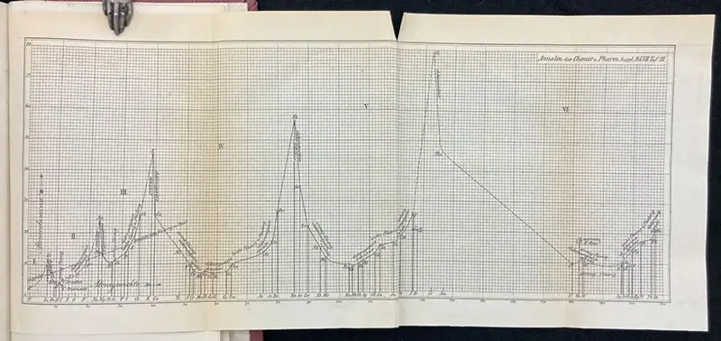
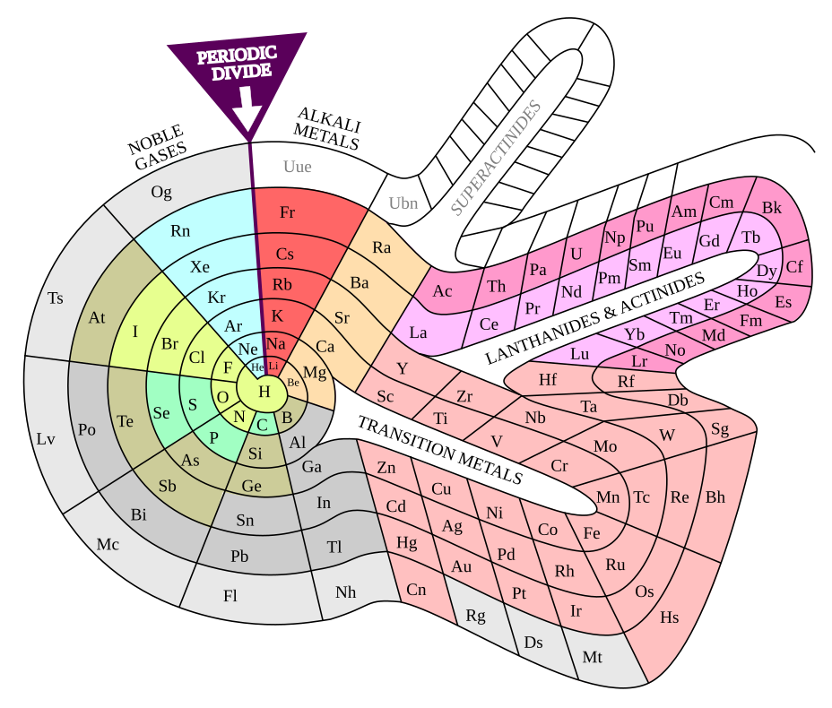
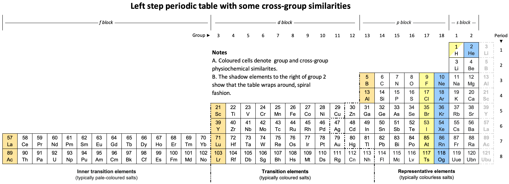
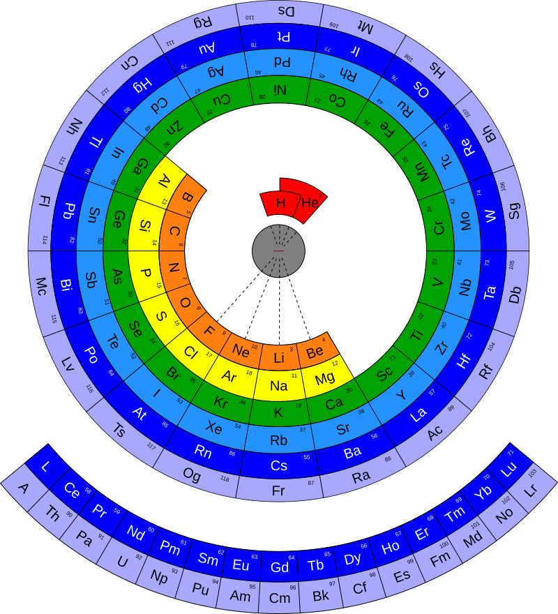

The periodic table is one of the most successful data visualisation ever
made. Its data is essentially just a **one-dimensional list**: the elements
sorted by atomic number, 1 to 118. Turning this list into a "table" involves a
*layout choice*.
Although one version has become canonical over the past 150 years, there are numerous alternative possible designs.

<!--

In this part you will: build the physics that makes the list periodic,
look at real alternative designs (and pick a favourite), construct a
**periodic spiral** yourself, and then construct the canonical table,
and ask, as designers, why it became *the* one. -->

All code runs in your browser. The first cell may take a few seconds while
Python loads.

```{pyodide}
#| autorun: true
#| edit: false
import js
import numpy as np
import matplotlib.pyplot as plt
from pyodide.http import open_url

# Data files live beside this page; the Python worker runs from site_libs/.
DATA_URL = js.location.href.split("site_libs/")[0] + "data/"

plt.rcParams.update({
    "figure.figsize": (9, 5),
    "axes.spines.top": False,
    "axes.spines.right": False,
    "axes.grid": True,
    "grid.alpha": 0.22,
    "font.size": 11,
})
print("Environment ready.")
```

```{pyodide}
#| autorun: true
#| include: false
# Pre-build every name the page uses, so each cell works no matter which
# cells were run before it. The visible cells re-derive all of this.
text = open_url(DATA_URL + "elements.csv").read()
rows = [line.split(",") for line in text.strip().split("\n")[1:]]
Z        = [int(r[0]) for r in rows]
symbol   = [r[1] for r in rows]
name     = [r[2] for r in rows]
period   = [int(r[3]) for r in rows]
group    = [int(float(r[4])) if r[4] else None for r in rows]
block    = [r[5] for r in rows]
category = [r[6] for r in rows]
radius   = [float(r[7]) if r[7] else None for r in rows]

subshells = sorted(((n, l) for n in range(1, 8) for l in range(n)),
                   key=lambda t: (t[0] + t[1], t[0]))
L_NAMES = "spdf"

def configuration(z):
    conf, left = [], z
    for n, l in subshells:
        if left == 0:
            break
        take = min(left, 2 * (2 * l + 1))
        conf.append((n, l, take))
        left -= take
    return conf

def shells(z):
    out = {}
    for n, l, e in configuration(z):
        out[n] = out.get(n, 0) + e
    return out

def valence(z):
    sh = shells(z)
    return sh[max(sh)]

PERIOD_LEN = {1: 2, 2: 8, 3: 8, 4: 18, 5: 18, 6: 32, 7: 32}
block_colours = {"s": "#4269d0", "p": "#30a8b1", "d": "#c98a00", "f": "#9475cd"}

def spiral_coords(i):
    p = period[i]
    start = sum(PERIOD_LEN[q] for q in range(1, p))
    frac = (Z[i] - start) / PERIOD_LEN[p]
    return 2 * np.pi * frac, (p - 1) + frac

```

## 1 · Atoms and electron shells

An element is defined by one number: **Z**, the count of protons in the
nucleus (e.g. carbon is "element six").

A neutral atom carries Z electrons. These electrons stack into **shells** around
the nucleus that hold at most $2n^2$ electrons: 2, 8, 18, 32.

Only the outermost shell interacts with other atoms, so atoms with the same outer shell
arrangement behave alike.

The data for this page is one row per element: number, symbol, name,
and a few properties we will meet as we need them:

```{pyodide}
text = open_url(DATA_URL + "elements.csv").read()
rows = [line.split(",") for line in text.strip().split("\n")[1:]]
Z        = [int(r[0]) for r in rows]
symbol   = [r[1] for r in rows]
name     = [r[2] for r in rows]
period   = [int(r[3]) for r in rows]
group    = [int(float(r[4])) if r[4] else None for r in rows]
block    = [r[5] for r in rows]
category = [r[6] for r in rows]
radius   = [float(r[7]) if r[7] else None for r in rows]

print(f"{len(Z)} elements, {name[0]} to {name[-1]}")
```

```{pyodide}
assert len(Z) == 118 and Z == list(range(1, 119))
print("✓ 118 elements: the data is literally just a sorted list")
```

Shells fill in a fixed order (the *aufbau* order: sub-shells sorted by
$n+l$, ties broken by $n$). Carefully review how this is produced by the code:

```{pyodide}
subshells = sorted(((n, l) for n in range(1, 8) for l in range(n)),
                   key=lambda t: (t[0] + t[1], t[0]))
L_NAMES = "spdf"

def configuration(z):
    """Idealised shell filling: list of (n, l, electrons)."""
    conf, left = [], z
    for n, l in subshells:
        if left == 0:
            break
        take = min(left, 2 * (2 * l + 1))   # sub-shell capacity 2(2l+1)
        conf.append((n, l, take))
        left -= take
    return conf

def shells(z):
    """Electrons per shell number n."""
    out = {}
    for n, l, e in configuration(z):
        out[n] = out.get(n, 0) + e
    return out

def valence(z):
    """Electrons in the outermost shell."""
    sh = shells(z)
    return sh[max(sh)]

print("sodium:", " ".join(f"{n}{L_NAMES[l]}{e}" for n, l, e in configuration(11)))
print("sodium by shell:", shells(11))
```

```{pyodide}
assert shells(11) == {1: 2, 2: 8, 3: 1}
assert sum(e for _, _, e in configuration(26)) == 26
assert [2 * n**2 for n in (1, 2, 3, 4)] == [2, 8, 18, 32]
print("✓ sodium is 2, 8, 1, and shell capacities are 2n²")
```


The shell arrangement of sodium can be pictured in a diagram:

```{pyodide}
fig, ax = plt.subplots(figsize=(5, 5))
ax.set_aspect("equal"); ax.axis("off")
ax.scatter([0], [0], s=200, color="#171717", zorder=3)
ax.annotate("Na", (0, 0), color="white", ha="center", va="center",
            fontsize=8, zorder=4)
for n, count in shells(11).items():
    ax.add_patch(plt.Circle((0, 0), n, fill=False, color="#bbbbbb", lw=1))
    ang = np.linspace(0, 2 * np.pi, count, endpoint=False) + np.pi / 2
    ax.scatter(n * np.cos(ang), n * np.sin(ang), s=45, color="#4269d0", zorder=3)
lim = max(shells(11)) + 0.6
ax.set_xlim(-lim, lim); ax.set_ylim(-lim, lim)
ax.set_title("Sodium: 2, 8, 1")
plt.show()
```

The lone outer electron places sodium in the same column as lithium
and potassium, also with one outer-shell electron.

## 2 · Periodicity

As Z is increased, the outer shell fills, closes, and starts again:

```{pyodide}
zz = list(range(1, 39))
vv = [valence(z) for z in zz]

fig, ax = plt.subplots(figsize=(9, 4.2))
ax.plot(zz, vv, "-", color="#bbbbbb", lw=1)
ax.scatter(zz, vv, s=28, color="#4269d0", zorder=3)
for z in (2, 10, 18, 36):                       # shell closures: noble gases
    ax.scatter([z], [valence(z)], s=60, color="#e66852", zorder=4)
    ax.annotate(" " + symbol[z - 1], (z, valence(z)), fontsize=9, color="#e66852")
ax.set_xlabel("atomic number Z")
ax.set_ylabel("electrons in outermost shell")
ax.set_title("Electrons in the outermost shell, Z = 1 to 38")
plt.show()
```

```{pyodide}
for z in (2, 10, 18, 36, 54, 86, 118):
    assert valence(z) == (2 if z == 2 else 8)   # closed shells: noble gases
for z in (3, 11, 19, 37, 55, 87):
    assert valence(z) == 1                      # fresh shells: alkali metals
print("✓ shell closures and fresh starts recur all the way to Z = 118")
```

The sawtooth is the periodic law. Every **row** of any periodic table is
a "tooth"; every **column** collects atoms caught at the same point of the
cycle: the **groups**.

Group 1 (one outer electron) are the reactive
alkali metals; group 18 (closed shell) are the noble gases that react
with almost nothing.


### Size of atoms {#sec-ex-radius}

The data column `radius` holds each element's covalent radius in
picometres. Plot radius against Z for all 118 elements, joined by a
faint line, and highlight the **alkali metals** (Z = 3, 11, 19, 37, 55,
87) in one colour and the **noble gases** (Z = 2, 10, 18, 36, 54, 86) in
another.

What does the pattern do at each shell closure?

```{pyodide}
#| setup: true
#| exercise: ex_radius
import js
import numpy as np
import matplotlib.pyplot as plt
from pyodide.http import open_url
DATA_URL = js.location.href.split("site_libs/")[0] + "data/"
text = open_url(DATA_URL + "elements.csv").read()
rows = [line.split(",") for line in text.strip().split("\n")[1:]]
Z      = [int(r[0]) for r in rows]
symbol = [r[1] for r in rows]
radius = [float(r[7]) if r[7] else None for r in rows]
plt.rcParams.update({
    "axes.spines.top": False, "axes.spines.right": False,
    "axes.grid": True, "grid.alpha": 0.22, "font.size": 11,
})
```

```{pyodide}
#| exercise: ex_radius
# `Z`, `symbol` and `radius` are loaded for all 118 elements.
ALKALI = (3, 11, 19, 37, 55, 87)
NOBLE  = (2, 10, 18, 36, 54, 86)

fig, ax = plt.subplots(figsize=(9.5, 4.6))
______

ax.set_xlabel("atomic number Z")
ax.set_ylabel("covalent radius (pm)")
plt.show()
```

::: {.hint exercise="ex_radius"}
**Hint 1.** Three layers: a faint `ax.plot(Z, radius, ...)` line, an
`ax.scatter` of all the points, then two more scatters for the
highlighted sets. `radius[z - 1]` is the radius of element `z`.
:::

::: {.hint exercise="ex_radius"}
**Hint 2.** For the highlights, loop
`for z in ALKALI: ax.scatter([z], [radius[z - 1]], ...)`, and add
`ax.annotate(symbol[z - 1], ...)` if you want labels.
:::

::: {.solution exercise="ex_radius"}
**Fully worked solution:**

```python
ALKALI = (3, 11, 19, 37, 55, 87)
NOBLE  = (2, 10, 18, 36, 54, 86)

fig, ax = plt.subplots(figsize=(9.5, 4.6))
ax.plot(Z, radius, "-", color="#cccccc", lw=1)
ax.scatter(Z, radius, s=14, color="#666666", zorder=3)
for z in ALKALI:
    ax.scatter([z], [radius[z - 1]], s=55, color="#4269d0", zorder=4)
    ax.annotate(" " + symbol[z - 1], (z, radius[z - 1]), fontsize=9,
                color="#4269d0")
for z in NOBLE:
    ax.scatter([z], [radius[z - 1]], s=55, color="#e66852", zorder=4)
ax.set_xlabel("atomic number Z")
ax.set_ylabel("covalent radius (pm)")
ax.set_title("Atomic size is periodic: peaks at the alkali metals")
plt.show()
```

Across each period atoms *shrink* (the growing nuclear charge pulls the
same shell tighter). At each new shell the size *jumps*: argon is
96 pm, and one proton later potassium is 196 pm. The sawtooth pattern is the same cycle Lothar Meyer plotted as atomic volume in 1870.

{width=85% fig-align="center"}
:::

## 3 · Alternative designs

If the data is a cycle, should its picture be a *grid*, or should it spiral?
Chemists have proposed various layouts. Compare these four alternative
designs:

**Mendeleev's own table (1869).** Periods run *down* the
columns. Groups run across the rows, transposed from the modern
convention. Gaps are deliberately left for elements Mendeleev predicted must
exist (gallium, scandium, germanium).

{width=45% fig-align="center"}

**Benfey's spiral (1964).** The list winds continuously outward from
hydrogen. The transition metals and the F-block bulge out.


{width=75% fig-align="center"}

**Janet's left-step table (1928).** Rows end where shells *actually*
close in the aufbau order, so the blocks form perfect staircase steps.


{width=95% fig-align="center"}

**A circular table.** Periodicity explicitly represented with concentric rings.

{width=60% fig-align="center"}


What are their advantages and disadvantages? Which do you prefer?

## 4 · Build the spiral

The spiral's claim is that the element list is a **cycle with no
breaks**, so draw it as one. Give every period one full turn: an
element's angle is its *fraction of the way through its period*, and its
radius grows steadily outward. Colour by **block** (which kind of
sub-shell is filling: the four "districts" of the table):

```{pyodide}
PERIOD_LEN = {1: 2, 2: 8, 3: 8, 4: 18, 5: 18, 6: 32, 7: 32}
block_colours = {"s": "#4269d0", "p": "#30a8b1", "d": "#c98a00", "f": "#9475cd"}

def spiral_coords(i):
    """Angle and radius for element index i. One full turn per period."""
    p = period[i]
    start = sum(PERIOD_LEN[q] for q in range(1, p))   # last Z before period p
    frac = (Z[i] - start) / PERIOD_LEN[p]             # 0 → 1 across the period
    return 2 * np.pi * frac, (p - 1) + frac

fig = plt.figure(figsize=(9.5, 9.5))
ax = fig.add_subplot(projection="polar")
thetas, rs = zip(*(spiral_coords(i) for i in range(118)))
ax.plot(thetas, rs, color="#dddddd", lw=0.7, zorder=1)
for i in range(118):
    ax.scatter(thetas[i], rs[i], s=40, color=block_colours[block[i]], zorder=3)
    ax.annotate(symbol[i], (thetas[i], rs[i]), fontsize=4.5, ha="center",
                va="center", color="white", zorder=4)
ax.set_xticks([]); ax.set_yticks([])
ax.spines["polar"].set_visible(False)
from matplotlib.lines import Line2D
ax.legend(handles=[Line2D([], [], marker="o", ls="", color=c, label=f"{b}-block")
                   for b, c in block_colours.items()],
          loc="upper left", bbox_to_anchor=(-0.1, 1.05), frameon=False, fontsize=9)
ax.set_title("The periodic spiral: one turn per period")
plt.show()
```

```{pyodide}
for z in (2, 10, 18, 36, 54, 86, 118):
    th, _ = spiral_coords(z - 1)
    assert abs(th - 2 * np.pi) < 1e-9
print("✓ every noble gas sits at the end of its turn: shell closures aligned")
```

Study what your spiral wins and loses. **Wins:** the sequence is
unbroken (no gap between Ba and La: the f-block is just part of the
winding); the blocks appear as coloured arcs (the lone gold dot opening
each purple arc is real chemistry showing through: lanthanum and
actinium actually take a d electron before the f shell starts filling); every shell closure lands
at the same angle, so the noble gases form a perfect ray. **Loses:**
almost every *other* group is misaligned: lithium and potassium sit at
different angles because their periods have different lengths, so
"reading down a group", the single most useful act chemists perform, no
longer works. Benfey's design (above) fixes this by distorting the
spiral into bulges, buying back group alignment by spending the clean
geometry. Every design pays for what it shows.

## 5 · Build the canonical table

Now the winner. Its layout rule is: **new row at every shell closure,
and columns collect equal outer-shell counts**: rows are periods,
columns are groups. Watch what happens with just the first 18 elements:

```{pyodide}
fig, ax = plt.subplots(figsize=(9.5, 2.6))
for i in range(18):
    x, y = group[i], -period[i]
    ax.add_patch(plt.Rectangle((x - 0.45, y - 0.45), 0.9, 0.9,
                               facecolor="#eef1f6", edgecolor="#888888"))
    ax.text(x, y, symbol[i], ha="center", va="center", fontsize=11)
ax.set_xlim(0, 19); ax.set_ylim(-3.8, -0.2)
ax.set_aspect("equal"); ax.axis("off")
ax.set_title("Periods as rows, groups as columns, and a gap appears")
plt.show()
```

There it is: the strange moat between beryllium and boron. The gap
exists because period 4 will need eighteen columns while periods 2 and 3
only have eight members; the layout reserves space for columns that do
not exist *yet*. That emptiness is the design's masterstroke: gaps in a
grid are **predictions**. Mendeleev's version of this move (holes left
under aluminium and silicon) told the world exactly what to look for,
and gallium (1875) and germanium (1886) walked into them with almost
exactly the predicted properties. Few charts in history have predicted
anything; this one predicted *matter*.

### Your turn: the whole thing {#sec-ex-table}

Build the full canonical table, all 118 elements. You have `Z`,
`symbol`, `period`, `group` and `category` (plus `cat_colours`, the
conventional colour for each category). Two things need decisions:

1. **Main grid:** elements with a `group` go at column `group`, row
   `period`, exactly like the 18-element version.
2. **The f-block:** the lanthanides (Z 57–71) and actinides (Z 89–103)
   have `group = None`. The canonical design exiles them to two
   **footnote rows** below the table. Place them there (15 per row)
   and choose the rows' vertical position yourself.

Colour every cell by its category, put the symbol (and, if you like, Z)
in each cell, and add a legend.

```{pyodide}
#| setup: true
#| exercise: ex_table
import js
import numpy as np
import matplotlib.pyplot as plt
from pyodide.http import open_url
DATA_URL = js.location.href.split("site_libs/")[0] + "data/"
text = open_url(DATA_URL + "elements.csv").read()
rows = [line.split(",") for line in text.strip().split("\n")[1:]]
Z        = [int(r[0]) for r in rows]
symbol   = [r[1] for r in rows]
period   = [int(r[3]) for r in rows]
group    = [int(float(r[4])) if r[4] else None for r in rows]
category = [r[6] for r in rows]
cat_colours = {
    "Alkali metals": "#ff6666", "Alkaline earth metals": "#ffdead",
    "Transition metals": "#ffc0c0", "Post-transition metals": "#cccccc",
    "Metalloids": "#cccc99", "Nonmetals": "#a0ffa0", "Halogens": "#ffff99",
    "Noble gases": "#c0ffff", "Lanthanides": "#ffbfff", "Actinides": "#ff99cc",
}
plt.rcParams.update({"font.size": 11})
```

```{pyodide}
#| exercise: ex_table
# Z, symbol, period, group, category and cat_colours are loaded.
# Write cell_position(i) -> (x, y), then draw all 118 cells.

def cell_position(i):
    ______

fig, ax = plt.subplots(figsize=(12, 7.2))
for i in range(118):
    x, y = cell_position(i)
    ax.add_patch(plt.Rectangle((x - 0.47, -y - 0.47), 0.94, 0.94,
                               facecolor=cat_colours[category[i]],
                               edgecolor="#777777", lw=0.6))
    ax.text(x, -y, symbol[i], ha="center", va="center", fontsize=8.5)
ax.set_xlim(0, 19); ax.set_ylim(-11, 0)
ax.set_aspect("equal"); ax.axis("off")
plt.show()
```

::: {.hint exercise="ex_table"}
**Hint 1.** `cell_position` has three cases: a real `group` (use it
with `period` directly), a lanthanide (57 ≤ Z ≤ 71), and an actinide.
The footnote rows need y values *below* row 7; leave a blank row as a
visual separator.
:::

::: {.hint exercise="ex_table"}
**Hint 2.** Within a footnote row the column should step with Z:
something of the shape `constant + (Z[i] - 57)` spreads the fifteen
lanthanides across fifteen consecutive columns. Pick the constant so
they sit roughly under the middle of the table.
:::

**How to know you got it.** No solution button: this table is yours.
Hold your result next to any printed periodic table: you should count
**18 columns**, **7 main rows**, and **two footnote rows of 15**;
hydrogen alone at top-left, helium at top-right above the noble-gas
column, and the colour regions forming solid blocks, not confetti. Two
things are worth noticing about what you just built. First, you never
told it any chemistry: `group` and `period` came from shell-counting,
yet sodium landed under lithium. Second, look at the two rows you
exiled: the footnote is a *lie of layout* (element 57 is not really
"below" the table; it belongs between 56 and 72), told to keep the
table printable. The spiral you built in Section 4 tells the truth about
continuity and lies about groups; the grid does the opposite. Which lie
you prefer is a design decision. Now check the notes you made in
Section 3 and see whether you still agree with yourself.



## 6 · Why the standard table won

The canonical table beat the spirals for reasons worth naming, because
they are the same reasons any visualisation wins:

- **It aligns the most-used comparison.** Chemists constantly reason
  "down a group": same outer shell, same reactions. The grid makes that
  a straight vertical scan; the spiral makes it a hunt.
- **It is rectangular.** It fits pages, posters, screens and
  blackboards; every cell has room for symbol, number, and mass. Most
  spiral designs waste half their canvas and cramp their inner turns.
- **Its gaps did work.** Empty grid cells are legible predictions;
  a spiral closes seamlessly over its own ignorance.
- **And then it won for winning.** After a century on every classroom
  wall, familiarity itself became the strongest argument: a standard
  everyone can read beats a design a few prefer (ask the QWERTY
  keyboard).

But "won" does not mean "true". The grid's clean rows are punctured by a
gap that means nothing physical, its f-block sits in exile, and the
cycle at the heart of the periodic law (the thing your sawtooth plots
showed most clearly) is invisible unless you already know to see it.
The spiral shows the cycle and hides the groups. Janet's steps show the
physics and misplace helium. Every layout of this list is an argument
about what matters; the one on the wall is just the argument that won.

## Sources

- `elements.csv` is generated from the
  [mendeleev](https://mendeleev.readthedocs.io/) Python package (v1.2):
  IUPAC groups and periods, Pyykkö covalent radii (all 118 elements,
  one consistent convention), Pauling electronegativities. The f-block
  rows carry no group number, following the common 18-column convention.
- The `configuration()` function implements the idealised Madelung
  (aufbau) rule and ignores the ~20 real-world exceptions (Cr, Cu, Nb,
  ...); none of them change where any element sits in the table.
- Images, all from Wikimedia Commons: Mendeleev's 1869 table (redrawn by
  NikNaks, public domain); Benfey-style element spiral by DePiep
  (CC BY-SA 3.0); left-step table by Sandbh (CC BY-SA 4.0); circular
  table by Cbuckley (CC BY 3.0).
- Category colours follow the long-standing Wikipedia convention, used
  here deliberately: this page is about *the* canonical design, and its
  colours are part of the canon. Note they are not a colour-blind-safe
  palette; the table survives that because position and text labels, not
  colour, carry the structure (worth noticing as a design lesson in
  itself).
